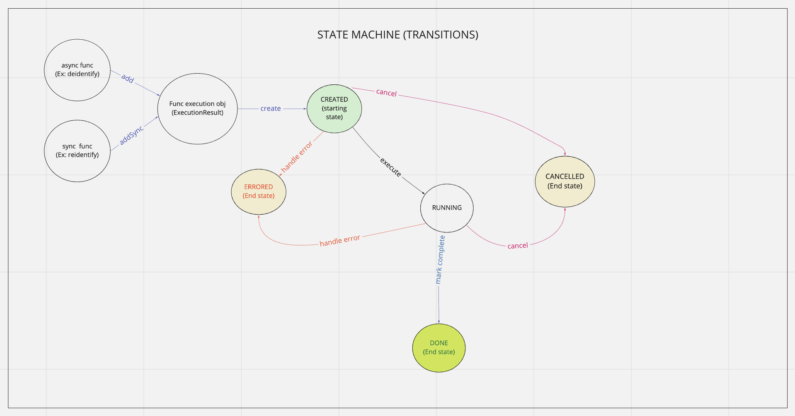
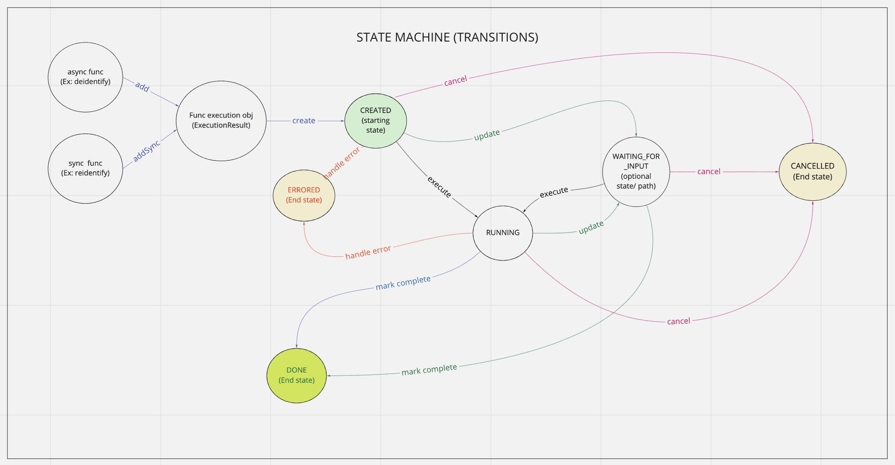

Django Turtle-Shell Usage Guide
===============================

Building App Using Turtle-shell
-------------------------------

Django turtle-shell supports asynchronous and synchronous execution of tasks. Using async with turtle-shell is easy when you want to allow long-running background tasks or update results once external systems complete.

There's an easy migration path from sync to async tasks.

First write your main functions to be run as turtle-shell executions like this.

Adding Functions To Registry
----------------------------

You can create executable functions for the app. For example:

.. code-block::

   def deidentify(sample_ids_list: Optional[str] = None,
                  flowcell_barcodes_list: Optional[str] = None,
                  deidentification_suffix: str = None,
                  flowcell_type: FlowcellType = FlowcellType.IPS):
       ...

This can be a function that needs to be executed asynchronously.

.. code-block::

   def reidentify(research_sample_ids: str,
                  send_email_to_third_party: Optional[bool] = False,
                  to_email_ids_list: Optional[str] = None,
                  flowcell_type: FlowcellType = FlowcellType.IPS):
       ...

This can be another function that needs to be executed in a synchronous fashion.

The ``_Registry`` class in turtle-shell provides the following template functionality to add such executable functions to the apps that derive from it.

In the apps that extend ``turtle_shell`` asyncronous or synchronous functions can be added as follows:

.. code-block::

    Registry = turtle_shell.get_registry()

    # Add function for new asynchronous executions
    Registry.add(deidentify)

    # Add function for new synchronous executions
    Registry.addSync(reidentify)

This will add functions ``deidentify`` and ``reidentify`` to the django app that can now be used to process requests with async or sync execution, respectively.
By adding them to the ``turtle-shell`` registry, this library converts these functions with annotations into a Django Form and optionally a graphql view. It leverages the features of defopt under the hood so that functions like this can become forms, generated from type annotations! Refer README for more details.

The ``turtle_shell`` model functions can be overridden to define app-specific implementations.

.. code-block::

    class AppExecution(turtle_shell.models.Execution):
        def get_current_state(inputs):
            # App specific behavior to calculate internal state of inputs (based on output from previous task),
            # the status (state)
            # and return the new internal state of inputs (or output at this stage) and new status (state)
            return current_inputs

        def _validate_inputs(inputs, func_name, status):
            # Define input validation for function executions
            # and return current state of inputs and status
            if inputs.valid():
                super()._validate_inputs(inputs, status)

        def create(**kwargs):
            # App specific behavior to start an execution
            input_json = self.cleaned_data(kwargs['input_json'])
            self.inputs = _get_inputs(self.uuid, input_json, self.status, None, next_state, None)
            cur_inp = super().create(self.inputs)
            return cur_inp

        def start(**kwargs):
            # App specific behavior for starting the function execution
            val_inp = super().start(self.inputs)
            return val_inp

The ``create_execution`` method is expected to validate arguments and prep data for downstream work. This should set the state to ``created``. For asynchronous functions, this can trigger queueing the executions with this state for async execution.

For any functions added, the first time the function is called as an execution, an ``ExecutionResult`` object is created. The input are stored as ``self.inputs`` on the object, and the previous return value is stored as ``self.state``.
You can also write a default function like ``get_current_state`` that simply takes inputs and state as arguments and returns a new state.

The ``get_current_state`` can call on the ``ExecutionManager`` to poll for internal state of object with the given inputs (uuid, input_json, current status etc.) and return the new state (output) and status based on the next transition.

The ``execute`` function can define the app-specific behavior for running a function. This can be triggered by the task (celery or other type) handler for asynchronous function executions.

.. code-block::

    def execute(**kwargs):
            # App specific behavior for running the function
            self.inputs = kwargs['input']
            func = self.func
            result_out = super().execute(self.inputs, func)
            return result_out

Then an optional ``update`` method like this:

.. code-block::

    def update(**kwargs):
         # App specific update functionality

The update method will take in current state and be expected to transition to next allowed state based on the status of the execution. In case of async function executions, this could update the status and intermediate outputs at each stage, if any.

You can optionally add a cancel method that would do cancel/ stop an execution that is in created or running states.

.. code-block::

    def cancel(**kwargs):
        # App specific implementation
        cancel_out = super().cancel(self.inputs)
        return cancel_out

Error handling and responses can be defined by overriding the ``handle_error_response`` function:

.. code-block::

    def handle_error_response():
        # App specific error response handling

You signal that still work to do via the ``update()`` function (dual return value?) and use ``handle_error_response()`` to signal that an error happened via exception.
If an execution fails with error due to external factors like network issues etc., then you can extend the functionality of ``execute()`` to define the behavior to ``rerun`` from the last checkpoint.

Details like input, execution states, creation/ update/ completion times, final response, intermediate stage updates or error response, if any for various functions in the app, through the ``ExecutionDetailView`` and ``ExecutionListView`` views.

Extending Turtle-shell Functionality
------------------------------------

Redefine `turtle-shell`` implementation to add executable functions with asyncronous or synchronous execution to ``_Registry`` class in turtle-shell template functionality.

.. code-block::

    def add(self, func, name=None, config=None):
        func_obj = self.get(name)
        if not func_obj:
           func_obj = _Function.from_function(func, name=name, config=config)

This adds an executable function that can be run asynchronously, which is the default mode of execution.

Functions that execute synchronously are a special case and can be added to the ``turtle-shell`` Registry using the following.

.. code-block::

    def addSync(self, func, name=None, config=None):
        func_obj = self.get(name)
        if not func_obj:
           func_obj = _Function.from_function(func, name=name, config=config)

Extending Views To Support Async/ Sync Function Views
-----------------------------------------------------

Redefine Views for asynchronous and synchronous function executions.

.. code-block::

    class ExecutionDetailView(ExecutionViewMixin, DetailView):
       # Implement the DetailView to show the progress of the execution

    class ExecutionListView(ExecutionViewMixin, ListView):
        def get_queryset()
            # List executions with status (Created, Started, Running, Done, Errored, Updating etc.)
            #order executions by("-created")

    class ExecutionCreateView(ExecutionViewMixin, CreateView):
        def get_form_kwargs()
            ...
        def get_context_data()
            ...

        def form_valid():
            self.object.create()
            ....

This provides views for asynchronous functions, which is the default execution mode. This can be overridden to define special case functionality for synchronous functions.

.. code-block::

    class SyncExecutionDetailView(ExecutionViewMixin, DetailView):
        pass
        #no op

    class SyncExecutionListView(ExecutionViewMixin, ListView):
        def get_queryset():
            #order executions by("-created")

    class SyncExecutionCreateView(ExecutionViewMixin, CreateView):
        def get_form_kwargs():
            ...
        def get_context_data():
            ...
        def form_valid():
            self.object.create()
            self.object.start()
            ...

Extend the functionality of the `ExecutionResult` model to define ways to create, run, update and cancel executions.

Define state machine constants (states, tranistions, callbacks statuses, etc)

The default state transitions in the django turtle-shell:

Define a manager ``ExecutionResultManager`` for managing the internal state and transitions of the execution objects with state machine defined above.
This should be able to poll for any state changes to execution instances and do the required to return current state and status for each object when called from ``get_current_state``.

Define tasks to pick up pending operations and move them to the next state. The newly executions created (objects with ``state="CREATED``) on ``create()`` would handle validating inputs, which can then be marked as pending to be picked up.
``advance()`` for each object would ideally take the current state, possible next state, current status and call on the next state to update the state and status.

.. code-block::

    @shared_task()
    def advance_executions():
    pending_executions = ExecutionResultManager.pending()
    for pending_exc in pending_executions:
        pending_exc.advance()
    return

The custom state machine must implement two functions:

.. code-block::

def advance()-> bool:
    # Logic to get current

def is_complete() -> bool:
    # Logic to define when the execution is complete in that state

And the task will continue running until ``is_complete()`` returns True (will be marked as DONE) or ``advance()`` returns False (will be marked as ERRORED)

The ``ExecutionResultManager`` can be extended to define handling state transitions and polling methods for different functions.

.. code-block::

    class ExecutionResultManager(models.Manager):
        model = ExecutionResult
        validator = ExecutionValidator()

        inputs = {}

        def pending(self):
            return Execution.objects.filter(
                status__in=XYZ # Define list of statuses that could be defined as pending
                # For example ExecutionResult.object.filter(status="CREATED")
            )

        def get_current_state(inputs):
            # Override this to define app-specific behavior
            # to calculate internal state of inputs (based on output from previous task),
            # the status and return the new internal state of inputs (or output at this stage) and new status.
            # This can be defined by apps extending this functionality.
            pass

        def handle_error_response(self, error_details):
            error_response = {}
            self.status = self.ExecutionStatus.ERRORED
            with transaction.atomic():
                self.save()

            error_response['uuid'] = self.uuid
            error_response['error_details'] = error_details
            ...
            return error_response

        def _validate_inputs(inputs, func_name):
            try:
                validate_execution_input(input['uuid'], func_name, input['input_json'])
                # Can be overridden to define app-specific input validation for function executions
            except ValidationException as ve:
                error_details = {'error_type': ve.error_type,
                                 'error_traceback': traceback,}
                return self.handle_error_response(error_details)
            return get_current_state(inputs, status)

        def _get_inputs(uuid, input_json, status, current_state, next_state, output_json):
            return {'input_json': input_json ,
                               'uuid': uuid,
                               'status': status,
                               'current_state': current_state, # Could be None to start with
                               'next_state': next_state # Could pass next possible state
                               'output_json': output_json # None until output is ready
            }

        def create(**kwargs):
            ...
            try:
                self.func = self.get_function()
                # Here the execution instance is created, so the
                cur_inp = get_current_state(self.inputs, self.status)
                self.status = cur_inp['status'] # will be self.ExecutionStatus.CREATED

                val_inp = self._validate_inputs(cur_inp, self.func, cur_status)
                self.status = val_inp['status']
                self.input_json = val_inp['input_json']
                self.output_json = val_inp['output_json']
                self.current_state = val_inp['current_state']

                with transaction.atomic():
                    self.save()
                 ...
            except CreationError as ce:
                error_details = {'error_type': ce.error_type,
                                 'error_traceback': traceback,}
                return self.handle_error_response(error_details)
            return cur_inp

An execution is created with ``create()`` and can be picked up by the tasks as ``pending`` and move to the next states as defined by the state transitions.
At this stage, the instance would have cleaned inputs from the form defined in ``input_json``. Once the inputs are validated with function-specific validations, the ``func`` instance can be advanced to execution.

Another possible state transition from here ``handle error response`` if the validation fails.

.. code-block::

        def execute():
            ...
            try:
                result = original_result = func(**self.inputs)
                result = json.loads(result.json())
                self.output_json = result
                self.inputs = _get_inputs(self.uuid, input_json, self.status, current_state, EXECUTE, self.output_json)
                result_out = get_current_state(self.inputs)
                self.status = result_out['status'] # will be self.ExecutionStatus.DONE
                self.input_json = val_inp['input_json']
                self.output_json = val_inp['output_json']
                self.current_state = val_inp['current_state']
                with transaction.atomic():
                        self.save()
            except ExecutionError as ee:
                error_details = {'error_type': ee.error_type,
                                 'error_traceback': traceback}
                return self.handle_error_response(error_details)
            ...
            return result_out

The ``cancel`` state can be used if the user cancels the execution before it advances to a running state.
By default, any execution will be canceled, which just means that it won't advance to the next
state but just be marked as cancelled. However, it won't cancel long-running background tasks.

If you want to customize cancellation behavior (e.g., cancelling a DNAnexus remote task), you can optionally override a ``cancel`` method with implemntation .

.. code-block::

        def cancel():
            ...
            self.inputs = _get_inputs(self.uuid, input_json, self.status, current_state, CANCEL, self.output_json)
            cancel_out = get_current_state(self.inputs, self.status)
            self.status = cancel_out['status'] # will be self.ExecutionStatus.CANCELLED
            self.input_json = val_inp['input_json']
            self.output_json = val_inp['output_json']
            self.current_state = val_inp['current_state']
            with transaction.atomic():
                self.save()
            ...
            return cancel_out

Define ``ExecutionValidator`` that can be extended for defining function-specific validations.

.. code-block::

    class ExecutionValidator:
        def validate_execution_input(self, uuid, func_name, input_json):
            # define validation here

``ExecutionStatus`` class defines the various states, statuses and transitions. This includes state machine constants (states, tranistions, callbacks statuses, etc)

.. code-block::

    class ExecutionStatus:
        # Define the statuses as constants
        CREATED = "created"
        RUNNING = "running"
        ERRORED = "cancelled"
        CANCELLED = "cancelled"
        DONE = "done"

        STATUS_CHOICES = (
        (CREATED, "Created execution"),
        (RUNNING, "Running"),
        (CANCELLED, "Cancelled"),
        (ERRORED, "Errored"),
        (DONE, "Completed"))

        # Define the transitions as constants
        CREATE = "create"
        ADVANCE = "advance"

        # The states of the machine
        SM_STATES = [
            dict(name=CREATED, on_enter=[ADVANCE]),
            # Can define more states for the machine like update
            # by overloading ADVANCE to move to next state each time
            dict(name=RUNNING, on_exit=[MARK_COMPLETE]),
            ...
        ]

        # The machine's initial state
        SM_INITIAL_STATE = CREATED

        # The machine's final states
        SM_FINAL_STATES = [DONE, CANCELLED, ERRORED]

        # The transititions as a list of dictionaries
        # This could be defined by classes that extend this functionality based on app-specific functionality
        SM_TRANSITIONS = [
            # reflexive transition to start state machine
            dict(trigger=CREATE, source='', dest=CREATED),
            # define how to advance from created to next states
            dict(trigger=ADVANCE, source=CREATED, dest=RUNNING),
            dict(trigger=ADVANCE, source=RUNNING, dest=DONE),
            # define how to move to cancelled state
            dict(trigger=CANCEL, source=CREATED, dest=CANCELLED),
            dict(trigger=CANCEL, source=RUNNING, dest=CANCELLED),
            # define how to move to errored state
            dict(trigger=ERROR, source=CREATED, dest=ERRORED),
            dict(trigger=ERROR, source=RUNNING, dest=ERRORED),
            ...
        ]

        # Define any other transition filters
        ...

# Ideally, the simplest state machine would be convenient to call this, cancel just stops it, can define max time limit on execution etc.
# QUESTION: How do you know whether we're done? Maybe, mark is_complete=True

StandardAsyncMachine(
    start_func=...,
    update_func=...,
    is_complete_func=...) =>calls update_func until is_complete_func is True
    (each time update_func takes in the previous output)

Future functionality
====================

In the future, we may want to allow users to update the inputs to a particular execution. Then, an optional ``update`` method can be defined like this:

.. code-block::

        def update():
            ...
            self.inputs = _get_inputs(self.uuid, input_json, self.status, current_state, UPDATE, self.output_json)
            update_out = get_current_state(self.inputs)
            self.status = update_out['status'] # will be self.ExecutionStatus.UPDATED
            self.input_json = val_inp['input_json']
            self.output_json = val_inp['output_json']
            self.current_state = val_inp['current_state']
            with transaction.atomic():
                self.save()
            ...
            return update_out

This would also need definition of a status for updated to the constants: ``UPDATED="updated"`` and ``(UPDATED,"Updated")``.

You signal that there is still work to do via the ``update()`` function (dual return value including initial state and updated state) and use ``handle_error_response()`` to signal that an error happened
via exception.  If an execution fails with error due to external factors like network issues etc., then you can extend the functionality of ``execute()`` to define the behavior to ``rerun`` from the last checkpoint.

The state machine transitions with ``update`` (or ``waiting_on_input`` state) would look like this:

